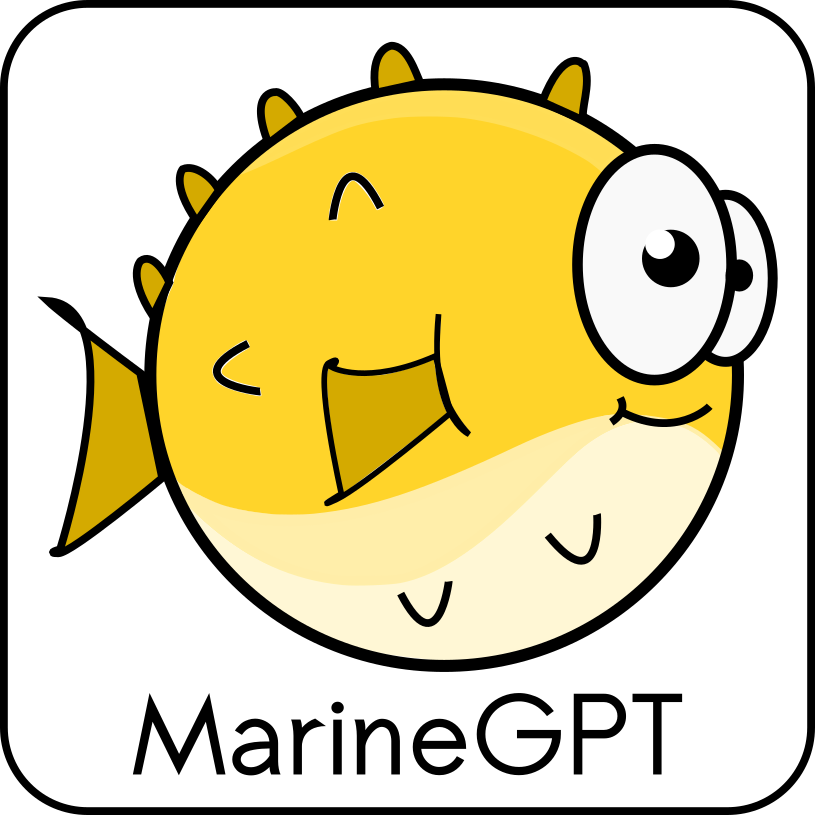
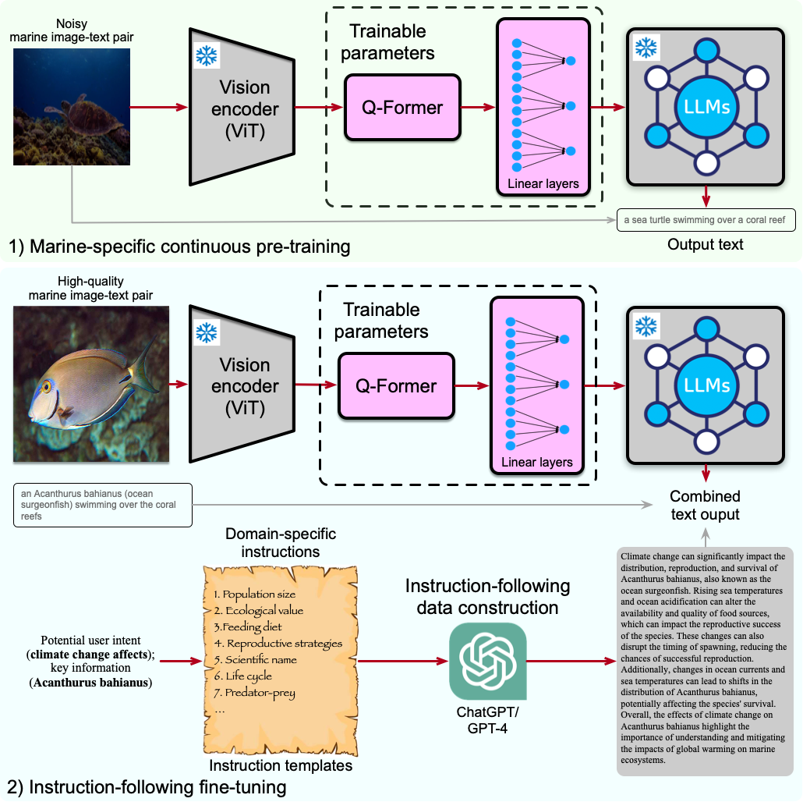
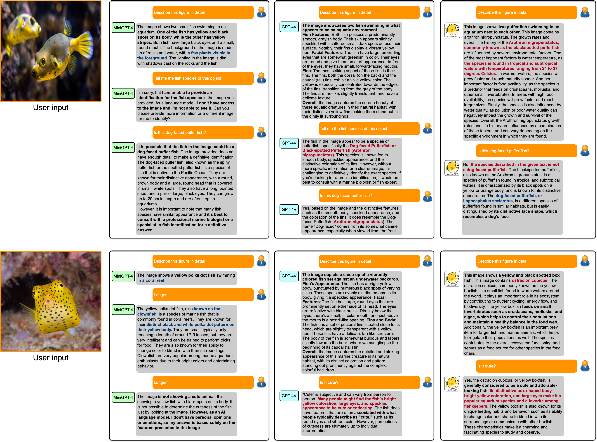
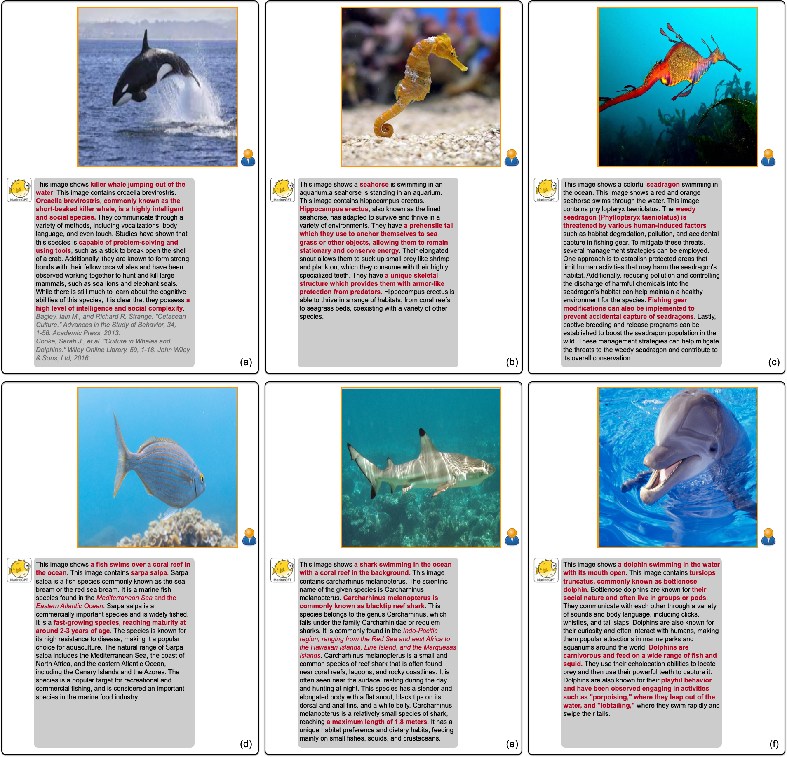
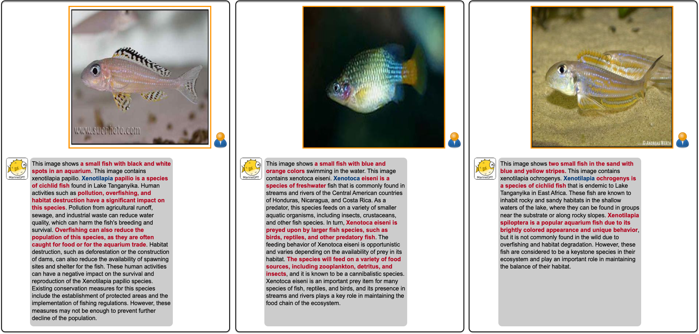
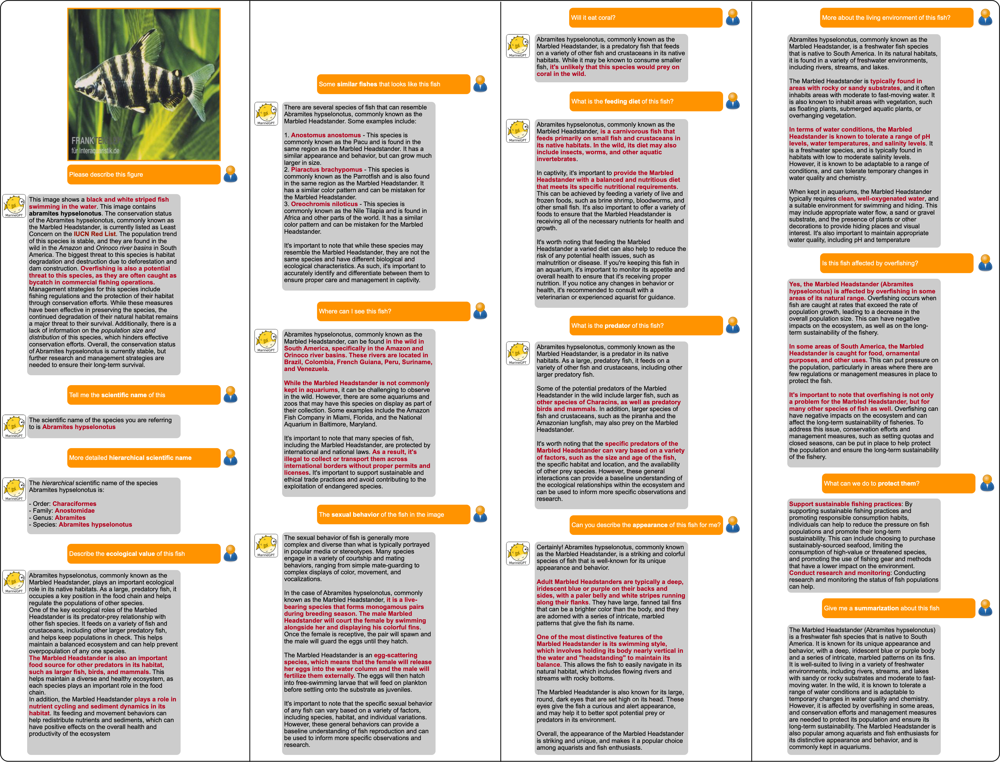

<!-- # Project Name

This software project accompanies the research paper, [Paper title](https://arxiv.org).

Brief description of the project.

## Documentation

## Getting Started  -->

#  MarineGPT: Unlocking Secrets of "Ocean" to the Public

<a href="https://marinegpt.github.io/MarineGPT/"></a>

<a href="">"></a>

A first vision-language model specially designed for the marine domain. It could generate more **sensitive**, **informative**, and **scientific** responses as a powerful marine AI assistant.

[Ziqiang Zheng](https://zhengziqiang.github.io/), [Jipeng Zhang](https://2003pro.github.io/), [Tuan-Anh Vu](https://tuananh1007.github.io/), [Shizhe Diao](https://shizhediao.github.io/), [Yue Him Wong Tim](https://scholar.google.com/citations?user=M5j3ZiQAAAAJ&hl=zh-CN), [Sai-Kit Yeung](https://saikit.org/) 


## Overview

<p align="center">
    </a> <br>
    Framework of MarineGPT.
</p>

Key Contributions:
* MarineGPT - **Domain-specific (marine) MLLM + Instruction-following tuning** enable fine-grained marine object recognition and yield sensitive, informative and scientific response.
* Marine-5M Dataset (~5M) - A **Large-scale, Diverse, Broad-coverage** marine image-text dataset for promoting aligning visual-and-language modalities.
* A marine-specific data generation pipeline to create diverse (image, instruction, output) instruction-following training data.


## Abstract
Large language models (LLMs), such as ChatGPT/GPT-4, have proven to be powerful tools in promoting the user experience as an AI assistant. 
The continuous works are proposing multi-modal large language models (MLLM), 
empowering LLMs with the ability to sense multiple modality inputs through constructing a joint semantic space (*e.g.* visual-text space). 
Though significant success was achieved in LLMs and MLLMs, exploring LLMs and MLLMs in domain-specific applications that 
required domain-specific knowledge and expertise has been less conducted, especially for **marine domain**. 
Different from general-purpose MLLMs, the marine-specific MLLM is required to yield much more **sensitive**, **informative**, and **scientific** responses. 
In this work, we demonstrate that the existing MLLMs optimized on huge amounts of readily available general-purpose training data show a minimal ability 
to understand domain-specific intents and then generate informative and satisfactory responses. To address these issues, we propose **MarineGPT**, 
the first vision-language model specially designed for the marine domain, unlocking the secrets of the ocean to the public. 
We present our **Marine-5M** dataset with more than 5 million marine image-text pairs to inject domain-specific marine knowledge into our model 
and achieve better marine vision and language alignment. Our MarineGPT not only pushes the boundaries of marine understanding to the general public 
but also offers a standard protocol for adapting a general-purpose assistant to downstream domain-specific experts. We pave the way for a wide range of marine applications 
while setting valuable data and pre-trained models for future research in both academic and industrial communities.

## Results
* Comparison with [MiniGPT-4](https://minigpt-4.github.io/) and [GPT-4V](https://chat.openai.com/).

<p align="center">
    </a> <br>
</p>

* Recognizing various marine objects.

<p align="center">
    </a> <br>
</p>

* Fine-grained marine object recognition.

<p align="center">
    </a> <br>
</p>

* Comprehensive multi-round conversation

<p align="center">
    </a> <br>
</p>

##  Citing MarineGPT

If you find MarineGPT helpful, please consider citing:
```
@misc{zheng2023marinegpt,
      title={SurgicalSAM: Efficient Class Promptable Surgical Instrument Segmentation}, 
      author={Ziqiang Zheng and Jipeng Zhang and Tuan-Anh Vu and Shizhe Diao and Yue Him Wong Tim and Sai-Kit Yeung},
      year={2023},
      eprint={},
      archivePrefix={arXiv},
      primaryClass={cs.CV}
}
```